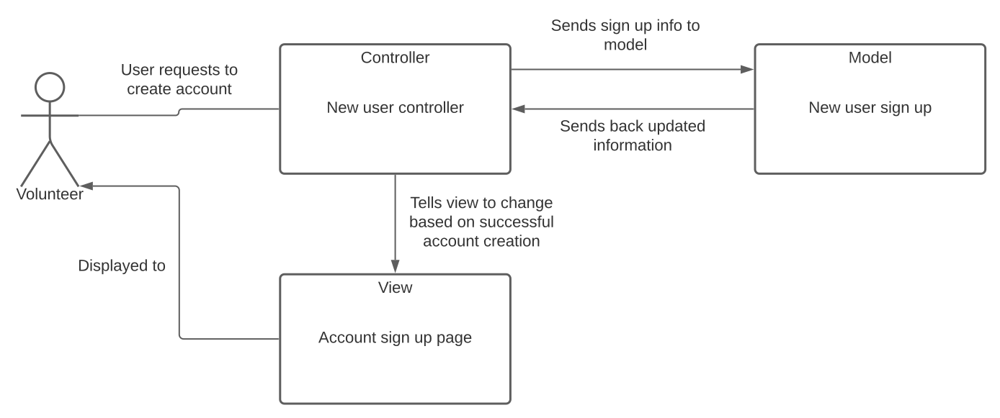

# Lab Report: Continuous Integration
___
**Course:** CIS 411, Spring 2021  
**Instructor(s):** [Trevor Bunch](https://github.com/trevordbunch)  
**Name:** Jamie Padovano
**GitHub Handle:** JPadovano1483
**Repository:** https://github.com/JPadovano1483/cis411_lab2_arch 
**Collaborators:** 
___

# Step 1: Confirm Lab Setup
- [x] I have forked the repository and created my lab report
- [x] I have reviewed the [lecture / discsussion](../assets/04p1_SolutionArchitectures.pdf) on architecture patterns.
- [x] If I'm collaborating on this project, I have included their handles on the report and confirm that my report is informed, but not copied from my collaborators.

# Step 2: Analyze the Proposal
Serve Central is a a moblie application that will allow the user to easily find new volunteer opportunities and register for them. It will track user statistics so they will be able to see what types of events users have preferred to volunteer for in the past. 

## Step 2.1 Representative Use Cases  

| Use Case #1 | |
|---|---|
| Title | Volunteer Looking for Service Opportunities |
| Description / Steps | Describes how the user finds and signs up for service opportunities in their area |
| Primary Actor | Volunteer |
| Preconditions | 1. Volunteer has an account and is signed in  2. Location services are turned on on the user's device  3. Volunteer finds an opportunity to sign up for |
| Postconditions | 1. Volunteer is signed up for service opportunity  2. Volunteer is sent a confirmation of signup along with all the necesary details (i.e. organization, location, time, type of service, etc.) |

| Use Case #2 | |
|---|---|
| Title | Service agency lists upcoming service opportunities |
| Description / Steps | Service agency is looking for volunteers and inputs the event info into the application which stores this info in its database|
| Primary Actor | Service Agency |
| Preconditions | 1. Service agency has an event planned  2. Agency is looking for more volunteers |
| Postconditions | 1. Service agency is notified of all volunteers that sign up through the application  2. Agency runs the event |

## Step 2.2 Define the MVC Components

| Model | View | Controller |
|---|---|---|
| Service event is listed in the application's database | Nearby service event list | Tells view to display service event info |
| Login credentials checked | Login Page | Tells view to change based on login attempt success |
| New user sign up| Account sign up page | Tells view to change based on new account creation |
| User volunteer history data | Home page | Tells view to display user data |
| Organization information | Organization Page | Tells view to display organization information |

## Step 2.3 Diagram a Use Case in Architectural Terms
This diagram demonstrates the interaction between the user from the use case and the set of MVC where the user creates an account.

# Step 3: Enhancing an Architecture

## Step 3.1 Architecture Change Proposal
INSERT Architectural change proposal here, and how it meets the two new requirements.  Explain both the benefits and draw backs of your proposal.

## Step 3.2 Revised Architecture Diagram
INSERT IMAGE HERE with a Description.

# Step 4: Scaling an Architecture
INSERT Architectural change proposal here, and how it meets the four new requirements.  Explain both the benefits and draw backs of your proposal.  If the changes are significant, then you need to explain why the changes are necessary versus a nice-to-have enhancement.